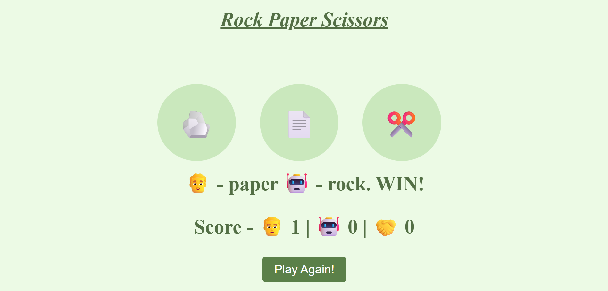

# 🪨📄✂️ Rock Paper Scissors Game

A fun, interactive **Rock Paper Scissors** game built using **HTML, CSS, and JavaScript**. This project was created to strengthen core JavaScript concepts and DOM manipulation skills.

---

## 🚀 Live Demo

[Click here to play the game](#)  
*(https://greeshma-kenche.github.io/rock-paper-scissors/)*

---

## 🎮 Features

- Play Rock, Paper, Scissors against the computer 🤖
- Emoji-based buttons for a more engaging UI
- Dynamic score updates after each round
- "Play Again" button to reset scores and start fresh
- Responsive layout with styled buttons and hover effects

---

## 🛠️ Technologies Used

- **HTML5** – Page structure and elements
- **CSS3** – Styling, button effects, and layout
- **JavaScript** – Game logic, DOM manipulation, event handling

---

## 🧠 What I Learned

Through this project, I practiced and reinforced the following concepts:

- ✅ Writing clean, readable **JavaScript functions**
- ✅ Using **objects** to store game logic (win/lose/draw conditions)
- ✅ Generating random outcomes using `Math.random()`
- ✅ Manipulating the **DOM** dynamically with `querySelector` and `.innerHTML`
- ✅ Handling **events** using `onclick` attributes
- ✅ Styling with CSS Flexbox and creating **interactive UI elements**
- ✅ Writing modular and maintainable code with separate HTML, CSS, and JS files

---

## 📂 File Structure

    rock-paper-scissors/
    ├── index.html
    ├── styles.css
    └── rock_paper_scissors.js

---

## 🖥️ How to Run This Project Locally

1. **Clone the repo**
   ```bash
   git clone https://github.com/greeshma-kenche/rock-paper-scissors.git

2. **Navigate into the project**
   ```bash
   cd rock-paper-scissors

3. **Open `index.html` in your browser**

---

## 📸 Screenshot



---

## 📌 Future Improvements

- Improve layout for mobile responsiveness

- Add a game history or leaderboard

- Use localStorage to remember scores